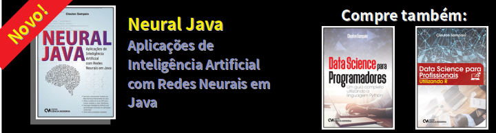

(c) **Cleuton Sampaio** 2018

**BEFORE USING THIS REPOSITORY** Please read the [**LICENSE**](./LICENSE) file. 
**ANTES DE USAR ESTE REPOSITÓRIO** Por favor leia o arquivo [**LICENSE**](./LICENSE).

This is a repository to learn [**Go programming language**](https://golang.org/). It's a complete and free basic **GoLang** programming course. 

Este é um repositório para aprender a [**Linguagem de programação Go**](https://golang.org/). É um curso completo e gratuito de programação básica com **GoLang**.

 [**REST API Com Postgres e Gorilla/Mux**](./portuguese/simpleapi) 
- [**Ui simplificada com Webview**](./portuguese/uidemo) / [**Simple Ui with Webview**](./english/uidemo)
- [**Redes neurais com Gorgonia**](./portuguese/deeplearning1)
- [**Neural networks with Gorgonia**](./english/deeplearning1)
- [**Banco de dados com gORM**](./portuguese/gorm1)
- [**Databases with gORM**](./english/gorm1)
- [**Programação concorrente com Goroutines**](./portuguese/goroutines1) 
- [**Concurrent programming with Goroutines**](./english/goroutines1)
- [**Lambda e FaaS com Go**](./portuguese/golambda)
- [**Go Lambda - FaaS**](./english/golambda) 
- [**BASIC GO PROGRAMMING COURSE**](./english/course.md);
- [**CURSO BÁSICO DE PROGRAMAÇÃO GO**](./portuguese/curso.md);
- [**No stress CUDA**](./english/cuda/nostress)
- [**CUDA sem stress**](./portuguese/cuda/nostress)

- [**English menu**](./english/README.md);
- [**Menu em português**](./portuguese/README.md);

