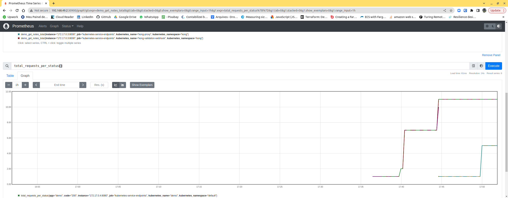

# Monitorando sua API GO com Prometheus e Grafana no k8s


Entregar sua **API** em ambiente **Kubernetes** (**k8s**) já é o máximo, agora, como vai monitorar sua aplicação? É necessária uma forma de monitoração que lhe dê também informações sobre o ambiente. O **Prometheus** e o **Grafana** são dois aliados importantíssimos para um **Devops** ou **SRE**.

Veremos como entregar sua aplicação **Go** em cluster **k8s** com direito à monitoração!

## Kubernetes

Se você não conhece **k8s** é melhor ver o **tutorial** anterior. Aqui já vou partir do princípio que você conhece o básico do **k8s**. Vamos utilizar o **minikube** mas tudo o que eu mostrar aqui é válido para qualquer cluster Kubernetes, mesmo serviços em **nuvem** como o **Amazon EKS**.

Neste tutorial estou utilizando o **Kong ingress controller** mas você pode utilizar qualquer um. 

## Criação dos objetos básicos

Você precisa compilar o código fonte para gerar a imagem docker correspondente: 

```
cd code
go build -o ../api.bin cmd/main.go
```

Depois, precisa criar uma imagem **Docker** do servidor **Go**. Se estiver utilizando um cluster **k8s** normal, deverá utilizar um servidor de imagens, como o [**Harbor**](https://goharbor.io/). Se for utilizar um serviço **k8s** em núvem, como o **Amazon EKS** deverá utilizar o serviço de armazenamento de imagens da **AWS**: **Amazon ECR - Elastic Container Registry**. 

Se estiver utilizando **minikube** então precisa mudar para o cliente **Docker** dele: 

```
eval $(minikube -p minikube docker-env)
```

Agora, você pode compilar sua imagem e ela será armazenada diretamente no **minikube**. Se estiver utilizando um repositório como o **Harbor** ou **ECR**, terá que fazer **docker login** e **docker push**. 

Para dar build na imagem: 

```
cd ..
docker build -t api:v001 .
```

### O Redis

Vamos utilizar nesta demonstração o database **NoSQL** **Redis**, simplesmente com a imagem padrão do **Dockerhub**. Para subir um contêiner Redis: 

```
docker run -p 6379:6379 --name some-redis -d redis
```

Se quiser executar a aplicação sem instalar no **k8s** basta isso. 

Precisamos utilizar o **Redis** apenas internamente, então precisamos criar um **Deployment** e um serviço **ClusterIP** com o nome que desejamos utilizar para configurar nosso servidor **Go**. O arquivo **redis.yaml** faz isso: 

```
apiVersion: apps/v1  
kind: Deployment
metadata:
  name: redisbase 
  labels:
    app: redis
spec:
  selector:
    matchLabels:     
      app: redis
  replicas: 1
  template:  
    metadata:
      labels:
        app: redis
    spec:
      containers:
      - name: redisbase
        image: redis
        ports:
        - containerPort: 6379
---
apiVersion: v1
kind: Service        
metadata:
  name: redis-db
  labels:
    app: redis
spec:
  type: ClusterIP
  ports:
  - port: 6379
    targetPort: 6379
  selector:
    app: redis
    
```

Agora, podemos subir nosso database com o comando: 

```
kubectl apply -f redis.yaml
```

Se quiser, verifique se o **pod** está no ar com: 

```
kubectl get pod

NAME                                     READY   STATUS    RESTARTS        AGE
demo-688f8b97fc-4h9j9                    1/1     Running   0               102m
dnsutils                                 1/1     Running   2 (4d22h ago)   5d23h
grafana-645d99bf78-79kp7                 1/1     Running   0               102m
my-nginx-b76ddff66-8d8js                 1/1     Running   2 (4d22h ago)   5d22h
prometheus-deployment-74cc56b8df-6lxlh   1/1     Running   0               64m
prometheus-deployment-74cc56b8df-tfrbq   1/1     Running   0               64m
redisbase-85d88d8b8-r45zj                1/1     Running   0               102m
```

Meu cluster já está com todos os serviços e pods criados. Para reverter (detetar) o redis: 

```
kubectl delete -f redis.yaml
```

## O servidor Go

O servidor vai ser criado por um **Deployment** e um **Service ClusterIP** tal como o database. O arquivo **serviceDeployment.yaml** faz isso: 

```
apiVersion: apps/v1
kind: Deployment
metadata:
  creationTimestamp: null
  labels:
    app: demo
  name: demo
spec:
  replicas: 1
  selector:
    matchLabels:
      app: demo
  strategy: {}
  template:
    metadata:
      creationTimestamp: null
      labels:
        app: demo
    spec:
      hostname: demo
      subdomain: demoapi
      containers:
      - image: docker.io/library/api:v001
        name: demo
        resources: {}
        imagePullPolicy: Never
        env:                     
          - name: API_DB_URL
            value: redis-db:6379

status: {}
---
apiVersion: v1
kind: Service
metadata:
  creationTimestamp: null
  labels:
    app: demo
  name: demo
spec:
  ports:
  - name: 8080-8080
    port: 8080
    protocol: TCP
    targetPort: 8080
  selector:
    app: demo
  type: ClusterIP
status:
  loadBalancer: {}

```

É só criar: 

```
kubectl apply -f serviceDeployment.yaml
```

Se quiser deletar isso: 

```
kubectl delete -f serviceDeployment.yaml
```

## Ingress para o serviço Go

Eu estou utilizando o **Kong Ingress Controller**, portanto, preciso criar uma regra de entrada para o serviço: 

```
kubectl apply -f ingress-rule.yaml
```

Para desfazer: 

```
kubectl delete -f ingress-rule.yaml
```

Com isso, nosso serviço já pode ser acessado externamente: 

```
export PROXY_IP=$(minikube service -n kong kong-proxy --url | head -1)

curl -i $PROXY_IP/api/note/34343

HTTP/1.1 404 Not Found
Content-Type: text/plain; charset=utf-8
Content-Length: 16
Connection: keep-alive
RateLimit-Reset: 32
X-RateLimit-Remaining-Minute: 3
X-RateLimit-Limit-Minute: 5
RateLimit-Remaining: 3
RateLimit-Limit: 5
Date: Mon, 06 Feb 2023 19:05:28 GMT
X-Kong-Upstream-Latency: 15
X-Kong-Proxy-Latency: 1
Via: kong/3.0.2

"Note not found"

```

## Prometheus

O **Prometheus** é uma ferramenta de métricas muito interessante, criado pela **SoundCloud**. Ele tem uma parte **cliente**, que você implementa em seu programa, e um servidor que coleta as métricas. No ambiente **k8s** ele pode utilizar o plugin **kubernetes_sd_configs** e descobrir todos os endpoints que exportam métricas no formato dele.

Instalar o Prometheus não é muito simples, mas bastam 3 arquivos yaml para isso. Primeiramente, vamos criar um perfil (ClusterRole) com direito a acesso a vários objetos no **k8s**, uma conta de serviço para executar o **Prometheus** e uma associação (Role Binding) entre a conta e o perfil. Tudo isso é feito no arquivo: **prometheus01.yaml**: 

```
apiVersion: rbac.authorization.k8s.io/v1
kind: ClusterRole
metadata:
  name: prometheus
rules:
- apiGroups: [""]
  resources:
  - nodes
  - services
  - endpoints
  - pods
  verbs: ["get", "list", "watch"]
- apiGroups: [""]
  resources:
  - configmaps
  verbs: ["get"]
- nonResourceURLs: ["/metrics"]
  verbs: ["get"]
---
apiVersion: v1
kind: ServiceAccount
metadata:
  name: prometheus
---
apiVersion: rbac.authorization.k8s.io/v1
kind: ClusterRoleBinding
metadata:
  name: prometheus
roleRef:
  apiGroup: rbac.authorization.k8s.io
  kind: ClusterRole
  name: prometheus
subjects:
- kind: ServiceAccount
  name: prometheus
  namespace: default
---
```

Para criar isso, use o comando: 

```
kubectl create -f prometheus01.yaml
```

Agora, é necessário configurar o **Prometheus**. Podemos fazer isso com um **ConfigMap**, que é um conjunto de dados de configuração, no formato chave-valor, que pode ser mapeado como um volume. Eis o arquivo que vamos criar: 

```
global:
  scrape_interval: 10s 
  external_labels:
    monitor: 'codelab-monitor'
scrape_configs:
- job_name: 'prometheus'
  scrape_interval: 5s
  static_configs:
  - targets: ['localhost:9090']
- job_name: 'kubernetes-service-endpoints'
  kubernetes_sd_configs:
  - role: endpoints
  relabel_configs:
  - action: labelmap
    regex: __meta_kubernetes_service_label_(.+)
  - source_labels: [__meta_kubernetes_namespace]
    action: replace
    target_label: kubernetes_namespace
  - source_labels: [__meta_kubernetes_service_name]
    action: replace
    target_label: kubernetes_name
```

Neste arquivo estamos configuranto o **Prometheus** para varrer os pods que emitam dados de monitoração a cada 10 segundos. Para criá-lo: 

```
kubectl create configmap prometheus-config --from-file prometheus.yml
```

Agora, a próxima coisa a fazer é instalar o servidor **Prometheus**: 

```
kubectl create -f prometheus02.yaml

apiVersion: apps/v1
kind: Deployment
metadata:
  name: prometheus-deployment
spec:
  replicas: 2
  selector:
    matchLabels:
      app: prometheus
  template:
    metadata:
      labels:
        app: prometheus
    spec:
      containers:
      - name: prometheus-cont
        image: prom/prometheus
        volumeMounts:
        - name: config-volume
          mountPath: /etc/prometheus/prometheus.yml
          subPath: prometheus.yml
        ports:
        - containerPort: 9090
      volumes:
      - name: config-volume
        configMap:
          name: prometheus-config
      serviceAccountName: prometheus
---
kind: Service
apiVersion: v1
metadata:
  name: prometheus-service
spec:
  selector:
    app: prometheus
  ports:
  - name: promui
    nodePort: 30900
    protocol: TCP
    port: 9090
    targetPort: 9090
  type: NodePort      
```

O arquivo **prometheus02.yaml** cria um **Deployment** e um **Service** do tipo **NodePort** para ele. Com isso, o serviço poderá ser acessado de fora do **k8s**. Note que estamos utilizando o **configmap** como um volume: 

```
        configMap:
          name: prometheus-config
```

## Como a API gera métricas

Boa pergunta!

Se olharmos o código do arquivo **cmd/main.go** veremos algumas coisas interessantes: 

```
	"github.com/prometheus/client_golang/prometheus/promhttp"
	"github.com/prometheus/client_golang/prometheus"
```

Se estiver utilizando o **go mod tidy** o download será automático, caso contrário, você terá que executar os comandos: **go get**: 

- go get github.com/prometheus/client_golang/prometheus
- go get github.com/prometheus/client_golang/prometheus/promauto
- go get github.com/prometheus/client_golang/prometheus/promhttp

Eu criei algumas coisas extras aqui: 

- Um **middleware** para instrumentar os requests.
- 3 métricas.
- Uma rota "/metrics" para o **prometheus** coletar.

O **middleware** nada está fazendo, mas poderíamos instrumentar uma métrica nele. Para utilizá-lo, precisamos informar: 

```
    ...
	router := mux.NewRouter()
	router.Use(prometheusMiddleware)
    ...
```

As 3 métricas são dois contadores e um vetor de requests por status code: 

```
var (
	NewNotes = prometheus.NewCounter(
		prometheus.CounterOpts{
			Name: "demo_new_notes_total",
			Help: "Total number of new notes requests",
		},
	 )
	 
	GetNotes = prometheus.NewCounter(prometheus.CounterOpts{
		Name: "demo_get_notes_total",
		Help: "Total number of get notes requests",
	},)

	totalRequests = prometheus.NewCounterVec(
		prometheus.CounterOpts{
			Name: "total_requests_per_status",
			Help: "Total requests per http status code",
		},
		[]string{"code"},
	)
)
```

Os dois primeiros são bem óbvios, mas o segundo é um dicionário com o **http status code** como chave. 

Eu incremento os contadores nos **handlers** dos requests: 

```
func ReadNote(w http.ResponseWriter, r *http.Request) {
	GetNotes.Inc()
	vars := mux.Vars(r)
	id := vars["id"]
	statusCode := 200
	if data, err := backend.GetKey(id); err == nil {
		WriteResponse(statusCode, data, w)
	} else {
		if err.Error() == "not found" {
			statusCode = 404
			WriteResponse(404, "Note not found", w)
		} else {
			statusCode = 500
			WriteResponse(500, "Error", w)
		}
	}
	totalRequests.WithLabelValues(strconv.Itoa(statusCode)).Inc()
}

func WriteNote(w http.ResponseWriter, r *http.Request) {
	NewNotes.Inc()
	decoder := json.NewDecoder(r.Body)
	defer r.Body.Close()
	var note db.Note
	statusCode := 200
	if err := decoder.Decode(&note); err != nil {
		statusCode = http.StatusBadRequest
		WriteResponse(http.StatusBadRequest, map[string]string{"error": err.Error()}, w)
		return
	}
	uuidString, err := backend.SaveKey(note.Text, note.OneTime)
	if err != nil {
		fmt.Println(err)
		statusCode = http.StatusBadRequest
		WriteResponse(http.StatusBadRequest, map[string]string{"error": "invalid request"}, w)
	} else {
		WriteResponse(200, map[string]string{"code": uuidString}, w)
	}
	totalRequests.WithLabelValues(strconv.Itoa(statusCode)).Inc()
}
```

O método **Inc()** incrementa os contadores. No caso do dicionário, eu passo o **http status code** como chave. 

A parte final é registrar nossos contadores e criar uma rota "/metrics" para o **prometheus**: 

```
	prometheus.MustRegister(NewNotes)
	prometheus.MustRegister(GetNotes)
	prometheus.MustRegister(totalRequests)
    ...
	router.Path("/metrics").Handler(promhttp.Handler())
```

Pronto! O código está preparado para enviar métricas ao **prometheus**.

## Executando o prometheus

Para enviar requests e ver as métricas, você pode utilizar o **curl**: 

- **POST** para criar nova nota: 

```
curl -i --header "Content-Type: application/json" --request POST --data '{"data" : "save this", "onetime" : false}' $PROXY_IP/api/note
HTTP/1.1 200 OK
Content-Type: text/plain; charset=utf-8
Content-Length: 47
Connection: keep-alive
RateLimit-Reset: 9
X-RateLimit-Remaining-Minute: 4
X-RateLimit-Limit-Minute: 5
RateLimit-Remaining: 4
RateLimit-Limit: 5
Date: Mon, 06 Feb 2023 19:37:51 GMT
X-Kong-Upstream-Latency: 4
X-Kong-Proxy-Latency: 1
Via: kong/3.0.2

{"code":"87adbcd0-027f-4147-bd06-9afe4555c5b2"}
```

Anote o código da nota na resposta e use para obter a nota: 

```
curl -i $PROXY_IP/api/note/87adbcd0-027f-4147-bd06-9afe4555c5b2
HTTP/1.1 200 OK
Content-Type: text/plain; charset=utf-8
Content-Length: 11
Connection: keep-alive
RateLimit-Reset: 11
X-RateLimit-Remaining-Minute: 4
X-RateLimit-Limit-Minute: 5
RateLimit-Remaining: 4
RateLimit-Limit: 5
Date: Mon, 06 Feb 2023 19:38:49 GMT
X-Kong-Upstream-Latency: 0
X-Kong-Proxy-Latency: 1
Via: kong/3.0.2

"save this"
```

Para ver as métricas, você pode enviar o request: 

```
curl -i $PROXY_IP/metrics
HTTP/1.1 200 OK
Content-Type: text/plain; version=0.0.4; charset=utf-8
Transfer-Encoding: chunked
Connection: keep-alive
RateLimit-Reset: 8
X-RateLimit-Remaining-Minute: 4
X-RateLimit-Limit-Minute: 5
RateLimit-Remaining: 4
RateLimit-Limit: 5
Date: Mon, 06 Feb 2023 19:39:52 GMT
X-Kong-Upstream-Latency: 4
X-Kong-Proxy-Latency: 1
Via: kong/3.0.2

# HELP demo_get_notes_total Total number of get notes requests
# TYPE demo_get_notes_total counter
demo_get_notes_total 27
# HELP demo_new_notes_total Total number of new notes requests
# TYPE demo_new_notes_total counter
demo_new_notes_total 8
# HELP go_gc_duration_seconds A summary of the pause duration of garbage collection cycles.
# TYPE go_gc_duration_seconds summary
go_gc_duration_seconds{quantile="0"} 2.8616e-05
go_gc_duration_seconds{quantile="0.25"} 7.5126e-05
go_gc_duration_seconds{quantile="0.5"} 0.000137162
go_gc_duration_seconds{quantile="0.75"} 0.000211554
go_gc_duration_seconds{quantile="1"} 0.002902397
go_gc_duration_seconds_sum 0.141513118
go_gc_duration_seconds_count 721
# HELP go_goroutines Number of goroutines that currently exist.
# TYPE go_goroutines gauge
go_goroutines 9
# HELP go_info Information about the Go environment.
# TYPE go_info gauge
go_info{version="go1.19.5"} 1
# HELP go_memstats_alloc_bytes Number of bytes allocated and still in use.
# TYPE go_memstats_alloc_bytes gauge
go_memstats_alloc_bytes 2.522264e+06
# HELP go_memstats_alloc_bytes_total Total number of bytes allocated, even if freed.
# TYPE go_memstats_alloc_bytes_total counter
go_memstats_alloc_bytes_total 1.303634976e+09
# HELP go_memstats_buck_hash_sys_bytes Number of bytes used by the profiling bucket hash table.
# TYPE go_memstats_buck_hash_sys_bytes gauge
go_memstats_buck_hash_sys_bytes 4268
# HELP go_memstats_frees_total Total number of frees.
# TYPE go_memstats_frees_total counter
go_memstats_frees_total 1.948717e+06
# HELP go_memstats_gc_sys_bytes Number of bytes used for garbage collection system metadata.
# TYPE go_memstats_gc_sys_bytes gauge
go_memstats_gc_sys_bytes 9.002648e+06
# HELP go_memstats_heap_alloc_bytes Number of heap bytes allocated and still in use.
# TYPE go_memstats_heap_alloc_bytes gauge
go_memstats_heap_alloc_bytes 2.522264e+06
# HELP go_memstats_heap_idle_bytes Number of heap bytes waiting to be used.
# TYPE go_memstats_heap_idle_bytes gauge
go_memstats_heap_idle_bytes 1.1812864e+07
# HELP go_memstats_heap_inuse_bytes Number of heap bytes that are in use.
# TYPE go_memstats_heap_inuse_bytes gauge
go_memstats_heap_inuse_bytes 4.112384e+06
# HELP go_memstats_heap_objects Number of allocated objects.
# TYPE go_memstats_heap_objects gauge
go_memstats_heap_objects 2720
# HELP go_memstats_heap_released_bytes Number of heap bytes released to OS.
# TYPE go_memstats_heap_released_bytes gauge
go_memstats_heap_released_bytes 1.0108928e+07
# HELP go_memstats_heap_sys_bytes Number of heap bytes obtained from system.
# TYPE go_memstats_heap_sys_bytes gauge
go_memstats_heap_sys_bytes 1.5925248e+07
# HELP go_memstats_last_gc_time_seconds Number of seconds since 1970 of last garbage collection.
# TYPE go_memstats_last_gc_time_seconds gauge
go_memstats_last_gc_time_seconds 1.6757123764944694e+09
# HELP go_memstats_lookups_total Total number of pointer lookups.
# TYPE go_memstats_lookups_total counter
go_memstats_lookups_total 0
# HELP go_memstats_mallocs_total Total number of mallocs.
# TYPE go_memstats_mallocs_total counter
go_memstats_mallocs_total 1.951437e+06
# HELP go_memstats_mcache_inuse_bytes Number of bytes in use by mcache structures.
# TYPE go_memstats_mcache_inuse_bytes gauge
go_memstats_mcache_inuse_bytes 9600
# HELP go_memstats_mcache_sys_bytes Number of bytes used for mcache structures obtained from system.
# TYPE go_memstats_mcache_sys_bytes gauge
go_memstats_mcache_sys_bytes 15600
# HELP go_memstats_mspan_inuse_bytes Number of bytes in use by mspan structures.
# TYPE go_memstats_mspan_inuse_bytes gauge
go_memstats_mspan_inuse_bytes 125280
# HELP go_memstats_mspan_sys_bytes Number of bytes used for mspan structures obtained from system.
# TYPE go_memstats_mspan_sys_bytes gauge
go_memstats_mspan_sys_bytes 162720
# HELP go_memstats_next_gc_bytes Number of heap bytes when next garbage collection will take place.
# TYPE go_memstats_next_gc_bytes gauge
go_memstats_next_gc_bytes 4.921328e+06
# HELP go_memstats_other_sys_bytes Number of bytes used for other system allocations.
# TYPE go_memstats_other_sys_bytes gauge
go_memstats_other_sys_bytes 1.545276e+06
# HELP go_memstats_stack_inuse_bytes Number of bytes in use by the stack allocator.
# TYPE go_memstats_stack_inuse_bytes gauge
go_memstats_stack_inuse_bytes 851968
# HELP go_memstats_stack_sys_bytes Number of bytes obtained from system for stack allocator.
# TYPE go_memstats_stack_sys_bytes gauge
go_memstats_stack_sys_bytes 851968
# HELP go_memstats_sys_bytes Number of bytes obtained from system.
# TYPE go_memstats_sys_bytes gauge
go_memstats_sys_bytes 2.7507728e+07
# HELP go_threads Number of OS threads created.
# TYPE go_threads gauge
go_threads 13
# HELP process_cpu_seconds_total Total user and system CPU time spent in seconds.
# TYPE process_cpu_seconds_total counter
process_cpu_seconds_total 18.47
# HELP process_max_fds Maximum number of open file descriptors.
# TYPE process_max_fds gauge
process_max_fds 1.048576e+06
# HELP process_open_fds Number of open file descriptors.
# TYPE process_open_fds gauge
process_open_fds 13
# HELP process_resident_memory_bytes Resident memory size in bytes.
# TYPE process_resident_memory_bytes gauge
process_resident_memory_bytes 1.5880192e+07
# HELP process_start_time_seconds Start time of the process since unix epoch in seconds.
# TYPE process_start_time_seconds gauge
process_start_time_seconds 1.6757026429e+09
# HELP process_virtual_memory_bytes Virtual memory size in bytes.
# TYPE process_virtual_memory_bytes gauge
process_virtual_memory_bytes 1.572007936e+09
# HELP process_virtual_memory_max_bytes Maximum amount of virtual memory available in bytes.
# TYPE process_virtual_memory_max_bytes gauge
process_virtual_memory_max_bytes 1.8446744073709552e+19
# HELP promhttp_metric_handler_requests_in_flight Current number of scrapes being served.
# TYPE promhttp_metric_handler_requests_in_flight gauge
promhttp_metric_handler_requests_in_flight 1
# HELP promhttp_metric_handler_requests_total Total number of scrapes by HTTP status code.
# TYPE promhttp_metric_handler_requests_total counter
promhttp_metric_handler_requests_total{code="200"} 2229
promhttp_metric_handler_requests_total{code="500"} 0
promhttp_metric_handler_requests_total{code="503"} 0
# HELP total_requests_per_status Total requests per http status code
# TYPE total_requests_per_status counter
total_requests_per_status{code="200"} 26
total_requests_per_status{code="404"} 9
```

Para acessar o **prometheus**: 

```
minikube service prometheus-service --url
```

Anote a URL e utilize para acessar o **prometheus**: 



Aí está nossa métrica de requests por status code. 

## Grafana

Muita gente gosta do **Grafana**, pois ele tem mais recursos de queries que o **prometheus**. Podemos utilizá-lo também em conjunto com o **prometheus** para monitorar as métricas. 

Primeiramente, precisamos instalar o **Grafana** no **cluster k8s** e criar um serviço para ele. O arquivo **grafana_service.yaml** faz isso: 

```
apiVersion: v1
kind: PersistentVolumeClaim
metadata:
  name: grafana-pvc
spec:
  accessModes:
    - ReadWriteOnce
  resources:
    requests:
      storage: 1Gi
---
apiVersion: apps/v1
kind: Deployment
metadata:
  labels:
    app: grafana
  name: grafana
spec:
  selector:
    matchLabels:
      app: grafana
  template:
    metadata:
      labels:
        app: grafana
    spec:
      securityContext:
        fsGroup: 472
        supplementalGroups:
          - 0
      containers:
        - name: grafana
          image: grafana/grafana:8.4.4
          imagePullPolicy: IfNotPresent
          ports:
            - containerPort: 3000
              name: http-grafana
              protocol: TCP
          readinessProbe:
            failureThreshold: 3
            httpGet:
              path: /robots.txt
              port: 3000
              scheme: HTTP
            initialDelaySeconds: 10
            periodSeconds: 30
            successThreshold: 1
            timeoutSeconds: 2
          livenessProbe:
            failureThreshold: 3
            initialDelaySeconds: 30
            periodSeconds: 10
            successThreshold: 1
            tcpSocket:
              port: 3000
            timeoutSeconds: 1
          resources:
            requests:
              cpu: 250m
              memory: 1Gi
          volumeMounts:
            - mountPath: /var/lib/grafana
              name: grafana-pv
      volumes:
        - name: grafana-pv
          persistentVolumeClaim:
            claimName: grafana-pvc
---
apiVersion: v1
kind: Service
metadata:
  name: grafana
spec:
  ports:
    - port: 3000
      protocol: TCP
      targetPort: http-grafana
  selector:
    app: grafana
  sessionAffinity: None
  type: LoadBalancer
  ```

  Você pode criar um serviço **NodePort** para acessá-lo fora do **cluster**, ou pode simplesmente usar um **port forward** e acessarmos em nossa estação: 

  ```
  kubectl port-forward service/grafana 3000:3000
  ```

  E agora podemos acessar o **Grafana** e criar métricas. A linguagem de query do Grafana é bem complexa e é assunto para um post à parte. 


