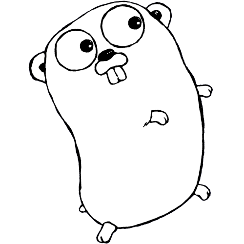
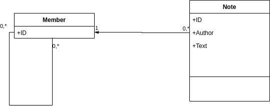

# ORM com Postgres



**Object Relational Mapping** (ORM) é uma técnica para mapear modelos de dados relacionais para modelos de classes. Com ela, passamos a lidar com objetos em nosso código e não mais com **SQL**. 

Minha opinião é que isso é extremamente desnecessário na maioria dos casos. Bastaria criar um tipo de **DAO** (Data Access Object) e trafegar instâncias de **DTOs** (Data Transfer Objects), evitando a complexidade desnecessária. Você pode isolar as operações básicas de SQL em um componente a parte, de modo a poder substituir o banco de dados, caso sena preciso. 

Tendo dito isso, ORM ainda é uma técnica muito valorizada no Mercado de TI, portanto, vale a pena aprender e praticar em qualquer linguagem de programação. Em **Go** temos o **Gorm** (https://gorm.io/), que funciona relativamente bem, sendo bastante popular. 

O repositório com o código exemplo deste tutorial está no [**golang.network**](https://github.com/cleuton/golang-network/tree/master/code/gorm1)

## Estudo de caso



Vamos implementar esse modelo apresentado no diagrama. Um **Member** pode escrever uma ou mais **Notes**, portanto, há um relacionamento one-to-many entre eles. Um **Member** também pode ter conexões com um mais **Members**, o que é um auto relacionamento many-to-many. 

Parece simples, mas é um modelo bem complexo de implementar utilizando um **ORM**. 

### Preparação

Primeiramente, temos que criar um projeto **Go** e um **módulo**. Você pode baixar as dependências: 

```
go get -u gorm.io/gorm
go get -u gorm.io/driver/postgres
```

Suba um contêiner Docker com o Postgres para testarmos: 

```
docker run -p 5432:5432 --name <name> -e POSTGRES_PASSWORD=<password> -d postgres
``` 

Escolha uma password que você se lembre. 

Vamos criar algumas variáveis de ambiente para definir os parâmetros da conexão com o **Postgres**: 

```
export DATABASENAME=postgres
export USERNAME=postgres
export PASSWORD=<a senha que utilizou para subir o contêiner>
export DATABASEHOST=localhost
```

Você pode mudar o database, ou o usuário, ou mesmo o host e tudo funcionará perfeitamente. 

### Criando o modelo

Sendo um **ORM**, você precisará de um modelo de classes para representar as entidades e relacionamentos que deseja persistir ou recuperar. Então vamos criar uma pasta "db" e um script "model.go": 

```
package model

import (
	"gorm.io/gorm"
)

type Member struct {
	gorm.Model
	Name         	string
	Email        	string
	// Self-referential many-to-many relationship:
	Connections  	[]Member `gorm:"many2many:member_connections"`
	// One-to-many relationship:
	Notes			[]Note `gorm:"foreignKey:MemberID"`
}

type Note struct {
	gorm.Model
	// Has one relationship
	Author		Member `gorm:"foreignKey:ID"`
	Text		string
	MemberID	string	
}
```

Podemos utilizar "gorm.Model" como um objeto que possui as propriedades básicas de toda entidade: 

```
// gorm.Model definition
type Model struct {
  ID        uint           `gorm:"primaryKey"`
  CreatedAt time.Time
  UpdatedAt time.Time
  DeletedAt gorm.DeletedAt `gorm:"index"`
}
```

Já tem os timestamps mais comuns e uma propriedade "ID" que será a **chave primária** da entidade. Ao declararmos esse objeto em nossas **structs** adicionamos essas propriedades. Note que algumas possuem **tags** (esses literais separados por acentos graves), são metadados sobre cada atributo. Por exemplo, a propriedade ID tem como metadado o fato de ser chave primária. 

Mapeamos o relacionamento entre **Member** e **Note** como bidirecional, ou seja, o Member sabe quais são as suas Notes e a Note sabe quem é o seu autor: 

```
type Member struct {
    ...
	Notes			[]Note `gorm:"foreignKey:MemberID"`
}

type Note struct {
    ...
	Author		Member `gorm:"foreignKey:ID"`
    ...
    MemberID	string	
}
```

Tivemos que incluir a chave estrangeira do Member na entidade Note (a propriedade **MemberID** e referí-la no relacionamento **Notes**).

Agora, o mais complicado um **autorelacionamento many-to-many** de um Member para outro: 

```
...
Connections  	[]Member `gorm:"many2many:member_connections"`
```

Ele criará a tabela associativa **member_connections** derivando os campos necessários, para resolver o relacionamento muitos-para-muitos entre membros (Um Member pode estar conectado a zero ou vários Members, que, por sua vez, podem estar conectados a zero ou vários outros Members).

Esse é o nosso modelo, que usaremos em nosso código demonstrativo. 

### Migration

O **Gorm** tem um mecanismo de **migration** simples, que permite gerar o esquema a partir do modelo. Ele não é perfeito, mas serve para modelos simples. Eu recomendaria utilizar o **golang-migrations** ou o [**Atlas**](https://atlasgo.io/) para isso.

Vamos crir um programa principal que demonstrará o nosso **ORM**. Comece assim: 

```
package main

import (
    "fmt"
    "os"
    "network.golang/curso-gorm/db"
    "gorm.io/driver/postgres"
    "gorm.io/gorm"
)

func main() {

    // Run postgres: docker run -p 5432:5432 --name <name> -e POSTGRES_PASSWORD=<password> -d postgres

    // Get credentials from Environment Variables:
    databaseName := os.Getenv("DATABASENAME") 
    userName := os.Getenv("USERNAME")
    password := os.Getenv("PASSWORD")
    host := os.Getenv("DATABASEHOST")

    dsn := fmt.Sprintf("host=%s user=%s password=%s dbname=%s port=5432 sslmode=disable TimeZone=America/Sao_Paulo",
                      host, userName, password, databaseName)
    fmt.Println(dsn)

    // Open connection to a postgresql database:
    db, err := gorm.Open(postgres.Open(dsn), &gorm.Config{
      DisableForeignKeyConstraintWhenMigrating: true,
    })
    if err != nil {
        panic("failed to connect database")
    }

    fmt.Println("OK")
    ...
```

Importamos tudo o que precisamos e criamos uma conexão com o banco de dados. O método **gorm.Open()** cria a conexão e permite passar parâmetros de configuração. 

Note que passei o parâmetro **DisableForeignKeyConstraintWhenMigrating** como **true** para que ele deixe de criar os constraints ao migrar o banco. Isso porque o modelo é muito complexo e dá problema na criação. Vamos criar os constraints para cada relacionamento manualmente. 

Agora, vamos criar a migração inicial, que vai criar o banco de dados. Isso pode ficar em um script separado, mas aqui eu resolvi juntar tudo: 

```
    // Let's run the migrations to create tables:

    db.Migrator().AutoMigrate(&model.Member{}, &model.Note{})

    // Let's create the constrants:
    db.Migrator().CreateConstraint(&model.Member{}, "Notes")
    db.Migrator().CreateConstraint(&model.Member{}, "Connections")
```

O **AutoMigrate** é sensacional. Basta passarmos os tipos do modelo que ele cria quase tudo o que é necessário. Depois, criamos dois constraints: Um para o relacionamento entre **Member** e **Note** (o slice **Notes**) e outro entre um **Member** e outro (o relacionamento **Connections**). Isso criará os constraints de **foreign key** necessários no banco de dados. 

Pronto! Podemos começar a brincar com o database.

### Criando entidades

Criar entidades é muito fácil. Veja só como criamos dois **Members**: 

```
    // Let's add some data:
    user1 := &model.Member{Name: "Paul", Email: "paul@testmail"}
    db.Create(&user1)
    user2 := &model.Member{Name: "John", Email: "john@test"}
    db.Create(&user2)
```

O método **db.Create()** faz isso para nós. Agora, vamos criar entidades relacionadas: 

```
    // Connect John to Paul: 
    db.Model(&user2).Association("Connections").Append(user1)
    db.Save(user2)

    // Paul wrote a note:
    db.Model(&user1).Association("Notes").Append(&model.Note{Author: *user1, Text: "This is a note"})
    db.Save(user1)
```

O primeiro comando adiciona o **Member** **user1** nas conexões do **Member** **user2**, e vai gerar os registros necessários nas tabelas. O método **db.Save()** atualiza a entidade no banco. 

### Consultando registros

O método **db.First()** encontra um registro de acordo com a chave primária. Se a entidade possui relacionamentos, podemos pré-carregar essas entidades relacionadas, assim acessamos tudo de uma só vez: 

```
    paul := &model.Member{}
    db.Preload("Notes").Preload("Connections").First(&paul,1)
```

Neste exemplo, pré-carregamos os dois relationamentos: **Notes** e **Connections** ao obter o **Member** cuja chave é 1.

Há várias maneiras de consultar entidades e você pode ver na [**documentação do Gorm**](https://gorm.io/docs/query.html). 

