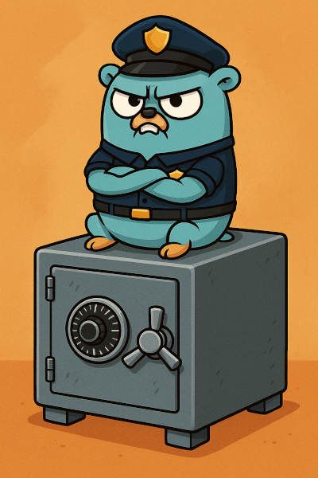

[**Cleuton Sampaio**](https://linkedin.com/in/cleutonsampaio)

[Repositório: **Golang Network**](https://github.com/cleuton/golang-network)

[Este projeto: **Senhas Go**](https://github.com/cleuton/golang-network/tree/master/code/senhas_go)


# Cofre de Senhas em Go

Biblioteca leve para gerenciamento de cofre de senhas, implementando criptografia AEAD (AES‑GCM) e autenticação HMAC. Permite criar, abrir, listar, adicionar, atualizar, remover e sincronizar cofres sem expor a senha‑mestre ou as entradas em claro.

Eu uso essa biblioteca no meu projeto de cofre de senhas, que em breve estará disponível aqui.

## Funcionalidades

1. **CreateVault**: cria um novo cofre criptografado em arquivo.
2. **OpenVault**: abre um cofre existente e valida a senha‑mestre (sem decriptar entradas).
3. **ListLocais**: lista todos os `local` (campo descriptografado) armazenados.
4. **GetCredenciais**: recupera usuário e senha para um dado `local`.
5. **AddLocal**: adiciona uma nova entrada (`local`, `usuario`, `senha`).
6. **UpdateLocal**: altera usuário e/ou senha de um `local` existente.
7. **DeleteLocal**: apaga uma entrada por `local`.
8. **ExportClear**: exporta todo o cofre em formato JSON claro (todo conteúdo descriptografado).
9. **Sync**: sincroniza entradas de um cofre com outro, copiando ou atualizando registros.

## Instalação

```bash
# No módulo raiz do seu projeto
go get github.com/cleutonsampaio/senhas/vault
```

## Exemplo de Uso

```go
package main

import (
  "fmt"
  "github.com/cleutonsampaio/senhas/vault"
)

func main() {
  storage := vault.FileStorage{}
  
  // 1) Criar novo cofre
  v, err := vault.CreateVault("meu_cofre.json", "MinhaSenha123", storage)
  if err != nil {
    panic(err)
  }

  // 2) Adicionar entradas
  v.AddLocal("siteA", "userA", "passA")
  v.AddLocal("siteB", "userB", "passB")

  // 3) Listar locais
  locais, _ := v.ListLocais()
  fmt.Println("Locais:", locais)

  // 4) Recuperar credenciais
  user, pass, _ := v.GetCredenciais("siteA")
  fmt.Printf("siteA: %s / %s\n", user, pass)

  // 5) Exportar cofre em claro
  clear, _ := v.ExportClear()
  fmt.Println(clear)
}
```

## Testes

A biblioteca inclui testes em `vault/vault_example_test.go`. Para rodar:

```bash
go test ./vault
```

## Backend de Armazenamento

A interface **Storage** permite trocar facilmente o mecanismo de persistência. Por padrão, a implementação **FileStorage** grava um JSON em disco (permissão `0600`). Você pode criar seu próprio backend (por exemplo, banco de dados ou serviço remoto):

```go
type MeuDB struct { /* ... */ }
func (db MeuDB) Save(path string, data []byte) error { /* ... */ }
func (db MeuDB) Load(path string) ([]byte, error) { /* ... */ }
```

## Segurança

* Usa **PBKDF2‑HMAC‑SHA256** para derivar chave mestre da senha.
* Separa **Kauth** (HMAC) e **Kenc** (AES‑GCM) via **HKDF**.
* Cada entrada cifrada individualmente com IV e AAD.
* Protege contra força‑bruta, sem armazenar a senha‑mestre em disco.

## Licença

Este projeto está disponível sob a [Apache License 2.0](LICENSE).
