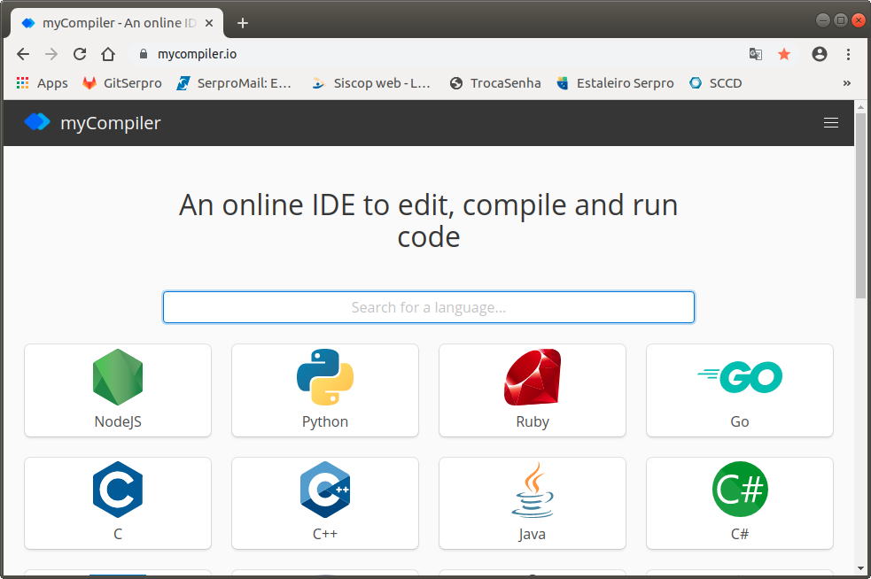
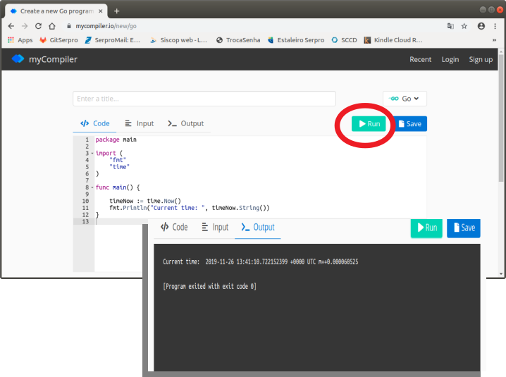

(c) **Cleuton Sampaio** 2018

# History and context

[**Go**](http://golang.org) is a [**compiled**](https://en.wikipedia.org/wiki/Compiled_language) program language created by **Google** in 2009. 

It has similarities with **C** and **Java**, but also with **Python**. Unlike Java, it does not require you to create a class in order to code an application.

Many developers call this language **golang** instead of simply **Go**. Because there is another programming language called [**Go!**](https://en.wikipedia.org/wiki/Go!_(programming_language)) (with exclamation mark) created in 2003 by Francis McCabe and Keith Clark.

**Why another programming language?**

Well, there are several explanations for this, but **Golang's** main differential is that it's a compiled language, focused on productivity, unlike other compiled languages ​​like **C++**. Since most modern programming languages ​​are interpreted (even those based on Virtual Machines), having a compiled programming language, with modern syntax, is an advantage for developers.

Another reason is that it has resources for [**concurrent programming**] (https://en.wikipedia.org/wiki/Concurrent_computing).

[**Wikipedia**](https://en.wikipedia.org/wiki/Go_(programming_language)) has an excellent answer to this question:

```
Go was designed at Google in 2007 to improve programming productivity in an era of multicore, networked machines and large codebases. The designers wanted to address criticism of other languages in use at Google, but keep their useful characteristics:

- Static typing and run-time efficiency (like C++);
- Readability and usability (like Python or JavaScript);
- High-performance networking and multiprocessing;
- The designers were primarily motivated by their shared dislike of C++.
```

## Free sample

Let's start? Learning a new language is very stressful, so let's avoid too many details early on. There is a *shortcut* that I really like: [**MyCompiler.io**](https://www.mycompiler.io/).



It's a kind of online IDE, which allows us to create and execute code in many languages, including **golang**. I recommend that you sign up and log in to save your code. Then choose **Go** and type the program  [**start.go**](./code/start.go).

```
package main

import (
	"fmt"
	"time"
)

func main() {

	timeNow := time.Now()
	fmt.Println("Current time: ", timeNow.String())
}
```

Enter this program on **MyCompiler** and run:



## One píece at a time

Every **golang** program has the same structure: Package declaration, *imports* and main function. And that is exactly how our program is divided.

First we declare a package called **main**. It could be another name, if we wanted to create a function library, but as my goal is to create an executable program, I have to put it inside a **main** package (we'll see this later).

```
package main
```

Then I can import code from other packages, similar to what we do in **Java** or **Python**. I'm importing two packages from the [**golang Standard Library**](https://golang.org/pkg/): *fmt* and *time*.

```
import (
	"fmt"
	"time"
)
```

Finally, I create a **function** called **main** and, inside its body, I put the commands I want to execute:

```
func main() {

	timeNow := time.Now()
	fmt.Println("Current time: ", timeNow.String())
}
```

Ok. How is this code executed? In **golang** every package called **main** generates an executable, and must have a function called **main**. For example, try renaming the function to see what happens...

```
runtime.main_main·f: function main is undeclared in the main package
```

## Challenge

Modify the program to display the date in Brazilian format: **dd/mm/aaaa hh:mm:ss**.
(Tip: https://golang.org/pkg/time/#Time.Format).

