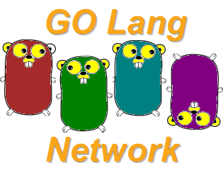

(c) **Cleuton Sampaio** 2018

# BEFORE STARTING

This is a basic programming course, but I assume that you already know algorithms and data structures, and also know some how to program using other programming languages, like: Java, Python, C etc. 

If you don't know programming fundamentals, then it would be better to look for a basic course.

I, as the course's author, offer no guarantee that you will learn to program using **Go**, nor do I offer any type of certificate or diploma. However, if there is dedication and personal effort on your part, you may learn the basics of this language and may be able to create applications with it.

## STRUCTURE

The course is divided into lessons. Follow them sequentially for better understanding. Some lessons offer **challenges** for you to solve, so I suggest that you try them. The answer is always placed in a subfolder **answer**. 

1. [**History and context**](./L01);
2. [**Datatypes, assignment, blocks**](./L02);
3. [**Code Modularity**](./L03);
4. [**Modularity: Structs**](./L04);
5. [**Interfaces**](./L05);
6. [**Base I/O**](./L06);
7. [**Packages**](./L07);