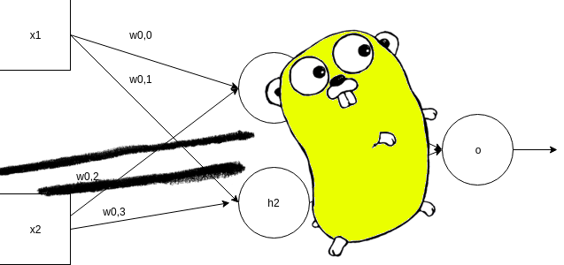
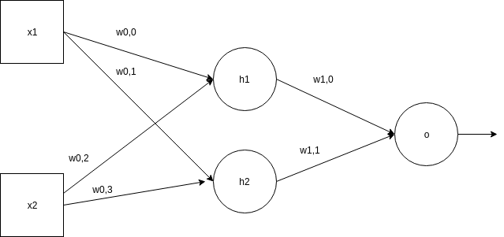
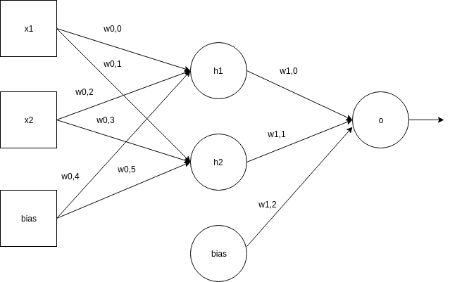

(c) **Cleuton Sampaio** 2019

# Neural Networks with Gorgonia



[**Deep learning** and neural networks](https://github.com/cleuton/neuraljava) is a very interesting subject and **Go** language supports this technology using the framework [**Gorgonia**](https://github.com/gorgonia).

**Gorgonia** works like similar frameworks, for example, [**Tensorflow**](https://www.tensorflow.org/), allowing the creation of [**graphs**](https://en.wikipedia.org/wiki/Graphics_theory) of operations and [**tensors**](https://en.wikipedia.org/wiki/Tensor).

There isn't something like [**Keras**](https://keras.io/) for **Gorgonia**, although the project [**Golgi**](https://github.com/gorgonia/golgi) is promising.

The programming is a little low level, because we have to create the graphs containing the operations and the tensors, so there is no concept of **neuron** nor **layers**, which exists in other frameworks.

In this post, I will show a very basic example of [**MLP** - Multilayer Perceptron](https://en.wikipedia.org/wiki/Multilayer_perceptron) trying to find the weights for an approximation of the [**exclusive disjunction** function or XOR](https://simple.wikipedia.org/wiki/Exclusive_disjunction).

## Installation

First, we have to install the necessary libraries. Oh, and for starters, your **Go** environment has to be 1.12 or higher!

```
$ go version
go version go1.13.5 linux/amd64
```

Then, install dependency packages:

```
go get gorgonia.org/gorgonia
```

There are very useful packages, such as:

- [**gonum**](https://github.com/gonum): [**numpy**](https://numpy.org/) like library for **Go**;
- [**gota**](https://github.com/go-gota/gota): [**pandas**](https://pandas.pydata.org/) like library for **Go**;


But in this example I will use only **gorgonia**.

## The example

I will create a two layered network, like the model: 



In this model, to simplify things, it doesn't include [**bias**](https://github.com/cleuton/neuraljava), which may make the network take a little longer to converge, but a better model It would be like this:



We have an input sequence of 4 pairs of numbers: {1,0}, {0,1}, {1,1}, {0,0}, with **shape** 4.2 (four lines and two columns). They are two input nodes, with four repetitions.

For this, we will have a [**hidden layer**](https://www.heatonresearch.com/2017/06/01/hidden-layers.html) of 2 nodes, so we will have a weight matrix with **shape** 2.2 (two rows and two columns), between the inputs and the hidden layer. 

And we have an exit node, so we have a weight column with **shape** 2.

The expected result of a **XOR** operation would be as follows: {1,1,0,0}.

## Model Assembly and Training

The [**example file**](https://github.com/cleuton/golang-network/blob/master/code/deeplearning1/mlp.go) imports the required libraries. I will start with the interesting part, which is to create a struct to represent our neural network model:

```
type nn struct {
	g      *ExprGraph
	w0, w1 *Node

	pred    *Node
	predVal Value
}
```

This struct contains pointers to the operations graph (g), the weight layer nodes (w0 - input / hidden and w1 - hidden / output), the output node (pred) and its value (predVal).

I created a method to return the weight matrices, or **learnables**, what the model is expected to learn. This makes the [**Backpropagation** part](https://en.wikipedia.org/wiki/Backpropagation) much easier:

```
func (m *nn) learnables() Nodes {
	return Nodes{m.w0, m.w1}
}
```

I also have created a [**factory method**](https://pt.wikipedia.org/wiki/Factory_Method) to instantiate the neural network:

```
func newNN(g *ExprGraph) *nn {
	// Create node for w/weight
	w0 := NewMatrix(g, dt, WithShape(2, 2), WithName("w0"), WithInit(GlorotN(1.0)))
	w1 := NewMatrix(g, dt, WithShape(2, 1), WithName("w1"), WithInit(GlorotN(1.0)))
	return &nn{
		g:  g,
		w0: w0,
		w1: w1}
}
```

Here we create two gorgonia matrices, informing their **shapes** and initializing with random numbers (using the Glorot algorithm).

We're just creating nodes in the graph! Nothing will really be performed by **gorgonia**!

I created a method for the [**Forward propagation**](https://towardsdatascience.com/forward-propagation-in-neural-networks-simplified-math-and-code-version-bbcfef6f9250) that takes the input array and passes the elements across the network: 

```
func (m *nn) fwd(x *Node) (err error) {
	var l0, l1, l2 *Node
	var l0dot, l1dot *Node


	// Camada de input
	l0 = x

	// Multiplicação pelos pesos e sigmoid
	l0dot = Must(Mul(l0, m.w0))

	// Input para a hidden layer
	l1 = Must(Sigmoid(l0dot))

	// Multiplicação pelos pesos:
	l1dot = Must(Mul(l1, m.w1))

	// Camada de saída:
	l2 = Must(Sigmoid(l1dot))

	m.pred = l2
	Read(m.pred, &m.predVal)
	return nil

}
```

We multiply the entries by the weights, calculate the [**Sigmoid**](https://en.wikipedia.org/wiki/Sigmoid_function) and move to the hidden layer, reaching the end.

Finally, in the **main()** method we instantiate our input vector and our result vector:

```
	// Set input x to network
	xB := []float64{1,0,0,1,1,1,0,0}
	xT := tensor.New(tensor.WithBacking(xB), tensor.WithShape(4, 2))
	x := NewMatrix(g,
		tensor.Float64,
		WithName("X"),
		WithShape(4, 2),
		WithValue(xT),
	)

	// Define validation data set
	yB := []float64{1, 1, 0, 0}
	yT := tensor.New(tensor.WithBacking(yB), tensor.WithShape(4, 1))
	y := NewMatrix(g,
		tensor.Float64,
		WithName("y"),
		WithShape(4, 1),
		WithValue(yT),
	)
```

Append the **Forward pass** in the graph: 

```
// Run forward pass
if err := m.fwd(x); err != nil {
    log.Fatalf("%+v", err)
}
```

Append the loss function [**MSE**](https://en.wikipedia.org/wiki/Mean_squared_error)

```
// Calculate Cost w/MSE
losses := Must(Sub(y, m.pred))
square := Must(Square(losses))
cost := Must(Mean(square))
```

And append the gradient and **Backpropagation** in the graph: 

```
// Do Gradient updates
if _, err = Grad(cost, m.learnables()...); err != nil {
    log.Fatal(err)
}
```

Finally, instantiate a **gorgonia** virtual machine and run the graph:

```
// Instantiate VM and Solver
vm := NewTapeMachine(g, BindDualValues(m.learnables()...))
solver := NewVanillaSolver(WithLearnRate(0.1))

for i := 0; i < 10000; i++ {
    vm.Reset()
    if err = vm.RunAll(); err != nil {
        log.Fatalf("Failed at inter  %d: %v", i, err)
    }
    solver.Step(NodesToValueGrads(m.learnables()))
    vm.Reset()
}
fmt.Println("\n\nOutput after Training: \n", m.predVal)
```

I repeated the training many times running the graph with **vm.RunAll()**.

This is the training result: 

```
Output after Training: 
 C[ 0.6267103873881292   0.6195071561964745  0.47790055401989834   0.3560452019123115]
```

You can create any neural network model with **Gorgonia**. This is just a kickstart.

