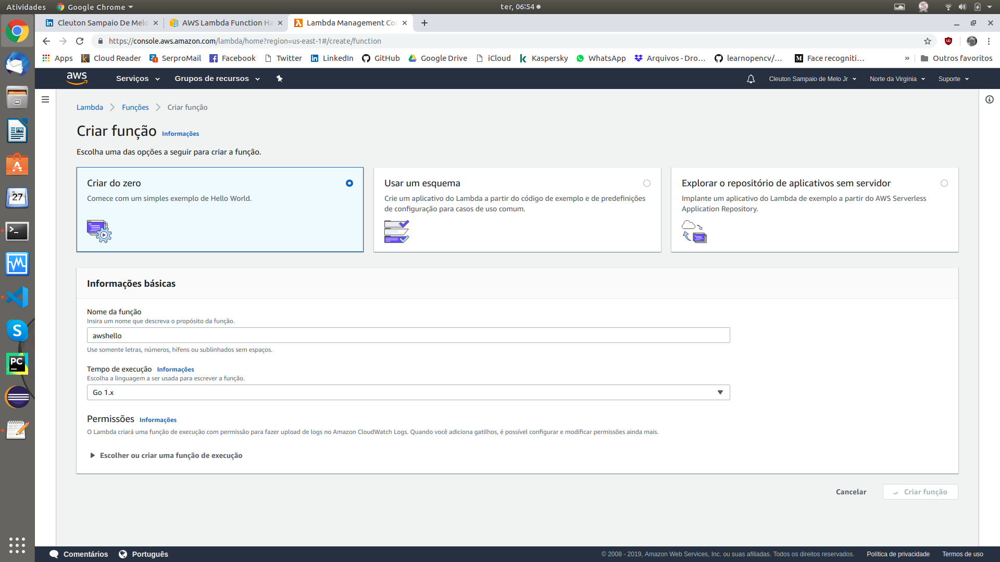
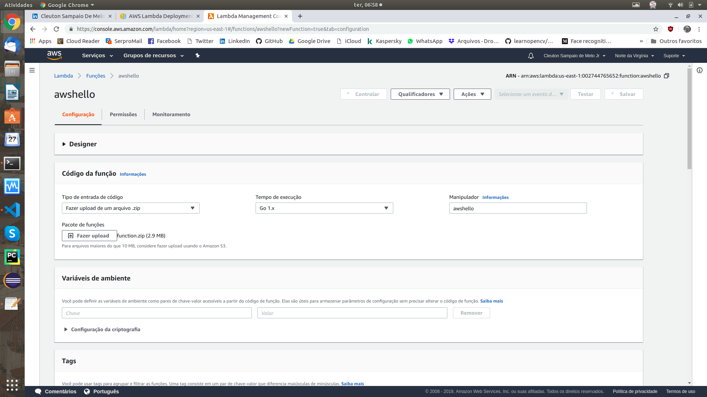
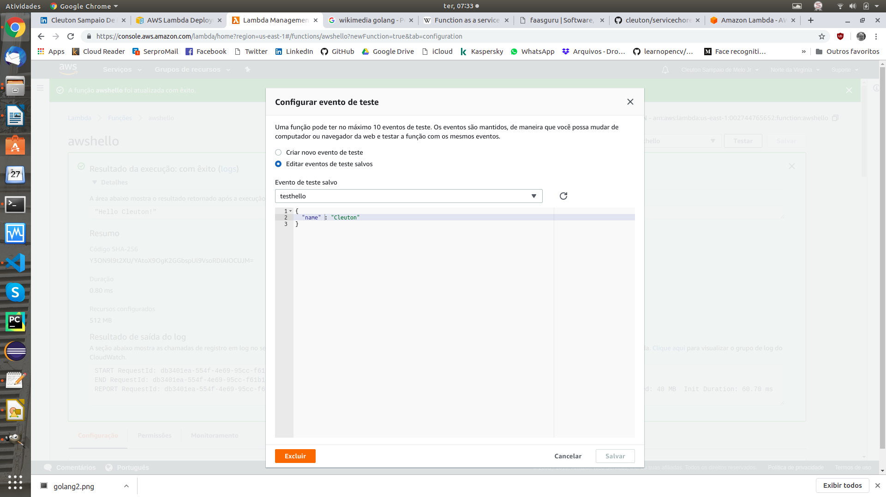
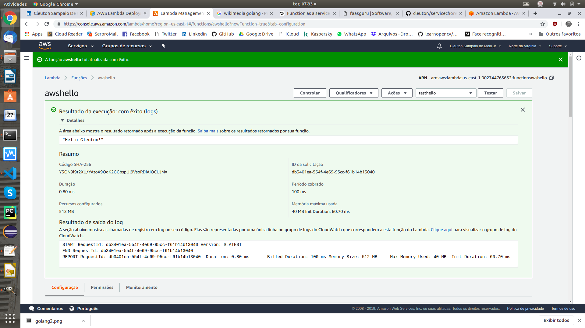

(c) **Cleuton Sampaio** 2018

## GO LAMBDA!


[**FaaS** or *Function as a Service*] (https://en.wikipedia.org/wiki/Function_as_a_service) is a way to expose a service function without the complexity of dealing with servers, platforms. and protocols. In fact, I have a dedicated blog about it: [**faas.guru**](http://faas.guru).


If we want to expose a business function using standard technologies such as: **REST**, **gRPC** or even [**Services Choreography**] (https://github.com/cleuton/servicechoreography ), we'll have a lot of **boilerplate code** in our project, ie: **accidental complexity**. This code does not add value to the function, but it is not harmless! It can generate big losses!

**FaaS** or **Serverless** is an alternative to focusing on what really matters, and that will bring us profit, leaving the infrastructure entirely to the cloud provider.

## AWS Lambda

The [**AWS lambda service**](https://aws.amazon.com/en/lambda/) allows us to create code in various languages ​​(Java, Python, javascript, Go etc) and get on the platform without to worry about the infrastructure part.

Let's create a very simple example, actually based on AWS's own example. See the [**source file**](../../code/golambda/awshello.go):

```
package main

import (
	"fmt"
	"context"
	"github.com/aws/aws-lambda-go/lambda"
)

type MyEvent struct {
	Name string `json:"name"`
}

func HandleRequest(ctx context.Context, name MyEvent) (string, error) {
	return fmt.Sprintf("Hello %s!", name.Name ), nil
}

func main() {
	lambda.Start(HandleRequest)
}

```

The code initiates a **HandleRequest()** function that simply gets a **struct** containing a **JSON string**. It just returns a greeting. But you could do anything, for example: Access a **DynamoDB** database for example.

## Compiling

First, you need to install the **aws-lambda-go** package:

```
go get github.com/aws/aws-lambda-go/lambda
```

Then you must compile the project:

```
GOOS=linux go build awshello.go
```

Finally, you need to create a **ZIP** with your project. The ZIP name must be the name of the generated executable (in our case "awshello"):

```
zip function.zip awshello
```

## Exporting

To deploy the package, you have two options: use **AWS CLI** or **AWS Console**. Unless you are using some kind of **Continuous Delivery**, the Console is simpler. Access the console and search for **AWS Lambda** service. Create a function using **Runtime Go**:



Then upload the zip file: 



And configure a new JSON test event: 



Now, just test your function: 



You can then configure an **AWS Services** Event to trigger your function, or you can create a route using the **AWS API Gateway**.

