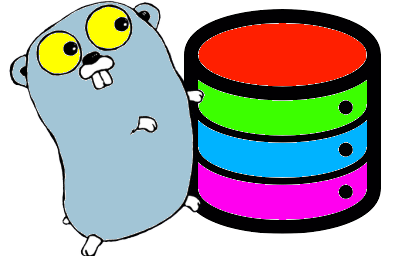

(c) **Cleuton Sampaio** 2018

## Database with gORM



Accessing the database is a headache for programmers in any programming language. Techniques such as [**ORM** - Object Relational Mapping](https://en.wikipedia.org/wiki/Object-relational_mapping) help improve productivity by reducing [**accidental complexity**](https://medium.com/background-thread/accidental-and-essential-complexity-programming-word-of-the-day-b4db4d2600d4) of [**DBMS**](https://www.geeksforgeeks.org/introduction-of-dbms-database-management-system-set-1/) interfaces.

In the **Go** ecosystem we have the popular [**gorm**](http://gorm.io/) package, which does this role very well. However, I must warn you that **gorm** has *characteristics* that can be a bit disturbing to anyone who works with other **ORM** packages, such as [**Hibernate**](https://hibernate.org/) for the **Java** language.

Unfortunately, the **gorm** site doesn't have clear enough examples and that's why I decided to write this post. The intention is to complement the information and to show a closer example of what is expected by the developers.

Common examples use a local [**sqlite**](https://www.sqlite.org/index.html) database, which is quite different from the reality of enterprise software developers, who uses a remote database server. So I decided to innovate and use a remote [**PostgreSQL**](https://www.postgresql.org/) hosted on the [**ElephantQL**](https://customer.elephantsql.com/instance ) service. To run the example, you will need to have a **ElephantQL** account and create a database instance there. Don't worry, it has a free level.

## Creating the Database

**gorm** assumes that you will use a primary key named **ID** which is an integer type. Although it works with any primary key types, some commands (such as **Find()**) work differently when the primary key data type is string, for example. 

**gorm** also assumes that you will map the database according to your structs, which is incorrect. Typically, in enterprise environments, you will have to work with a pre-existing database (other than testing). Therefore, I will use a pre-existing database.

After you create an account with **ElephantQL**, create a database instance. The free tier, called **Tiny turtle** only allows you to create a single instance, and has no admin tools. You will have to create your table using SQL. Open the **browser** option and execute the following **query**: 

```
CREATE TABLE pessoa (
    cpf             varchar(11) CONSTRAINT pkey PRIMARY KEY,
    nome            varchar(50) NOT NULL,
    data_nascimento date NOT NULL,
    funcionario     boolean
);
```
Ok, let me explain the fields' names: 
- cpf: Something like a SSN;
- nome: Person's name;
- data_nascimento: Birth date;
- funcionario: Is the person an employee?

Then open the **details** menu and copy the server DNS, the username and database name, and the password. ). In the **URL** field you can see which is the TCP port, usually 5432.

Create a **Go** code to test access, like this:

```
package main

import (
    "fmt"
    "time"
  "github.com/jinzhu/gorm"
  _ "github.com/jinzhu/gorm/dialects/postgres"
)

func main() {

    // Open connection to a postgresql database running on ElephantQL:
    db, err := gorm.Open("postgres", "host=elmer.db.elephantsql.com port=5432 user=userdbname dbname=userdbname password=password")
    if err != nil {
        panic("failed to connect database")
    }
    defer db.Close()
    fmt.Println("OK")
}
```

The fields **user** and **dbname** are the same.

Replace the fields in the **Open** method according to what you copied there in **ElephantQL**. If all is right, you will see a **OK** on the console.

What is **defer db.Close()**? The **defer** command puts the next command in a stack. We can put several commands in this stack. After the function returns (finish), the commands will be taken from the stack (FIFO) and executed. So I am stacking the close connection with the DBMS.

The [**full example**](https://github.com/cleuton/golang-network/tree/master/code//gorm1/godb.go) is a [**CRUD**](https://en.wikipedia.org/wiki/Create,_read,_update_and_delete) sample for you to see how commands work.

Before you begin, you need to install the **gorm** package:

```
go get github.com/jinzhu/gorm
```

## Mapping Tables

As an **ORM** framework, **gorm** requires you to map SQL tables to **structs**. So we need to define our structs, like this:

```
type Pessoa struct {
    Cpf string `gorm:"primary_key;type:varchar(11);column:cpf"`
    Name string `gorm:"type:varchar(50);column:nome"`
    BirthDate *time.Time `gorm:"column:data_nascimento"`
    Employee bool `gorm:"column:funcionario"`
}

```
What are these comments after field data types, surrounded by backticks? These are [**annotations** or **struct tags**](https://www.digitalocean.com/community/tutorials/how-to-use-struct-tags-in-go). These are extra statements about the elements, which can be read and processed by other code written in **Go**. Similar to the **Java** language annotations.

We can declare many things in [**struct tags**](http://gorm.io/docs/models.html), such as: primary key, data type, and column name in the table (if different from the name in the struct). I have declared the field that is the primary key, in addition to the column names and types.

## Inserting Data

**gorm** supports the use of transactions, and I am using this to enter data:

```
tx := db.Begin()
dt,_ := time.Parse("2006-01-02", "1979-08-18")
person1 := &Pessoa{"111","Person#1",&dt,false}
tx.Table("public.pessoa").Create(&person1)
person2 := &Pessoa{"222","Person#2",&dt,false}
tx.Table("public.pessoa").Create(&person2)
person3 := &Pessoa{"333","Person#3",&dt,false}
tx.Table("public.pessoa").Create(&person3)
...
tx.Commit()
```

Each command is executed within a transaction automatically. If we want to run multiple commands within a single transaction, we can do it, as I did in the example. The **Create()** method creates a record in the database using the **struct** data.

As I created a connection to the bank using the **db** variable, I could simply write: ```db.Create()```. But there are two problems:

1. The name of the table. **gorm** assumes that the table name is always plural of the struct's name. If the name is different, you have to enter **schema** and **table name**, using the **Table()** method;
2. I am running under a transaction, which is referenced by variable **tx**, so I have to use **tx** instead of **db**.

There is also the **tx.Rollback()** command to undo a transaction.

## Selecting Records

We can select records in various ways, such as the [**example**] (https://github.com/cleuton/golang-network/tree/master/code//gorm1/godb.go) does:

```
var person Pessoa
if result := db.Table("public.pessoa").First(&person); result.Error != nil {
    panic(result.Error)
}
fmt.Println("First person: ",person)
```

There are several things here. To begin with, the **First()** method selects the first record in a set. As I have not specified any filter condition, it will be the first record in the database, according to the primary key.

I am also showing how to handle errors. The function will return a **struct** that has an **Error** field. If it is null then the command worked. Otherwise, I can use **panic** command and finish the program. This works with **Create()** method as well.

I have shown other ways to select records, for example, more than one record:

```
var persons []Pessoa
if result := db.Table("public.pessoa").Find(&persons); result.Error != nil {
    panic(result.Error)
}
fmt.Printf("Persons: %+v\n",persons)
```

The **Find()** method returns all found records. As I did not specify filter, all will be same. So I need a **slice** to receive the records.

I also showed you how to select records according to a filter:

```
var person222 Pessoa
if result := db.Table("public.pessoa").Where("cpf like ?", "222").First(&person222); result.Error != nil {
    panic(result.Error)
}
fmt.Println("Person identified by cpf: ",person222)
```

Here I used the **Where()** method to select the first element whose cpf starts at 222.

## Update

Updating records is very intuitive:

```
fmt.Println("Before updating: ",person3.BirthDate)
if result := db.Table("public.pessoa").Where("cpf like ?", "333").First(&person3); result.Error != nil {
    panic(result.Error)
}
newdate, _ := time.Parse("2006-01-02", "1990-11-01")
if result := db.Table("public.pessoa").Model(&person3).Update("data_nascimento", &newdate); result.Error != nil {
    panic(result.Error)
}
fmt.Println("Person data updated",person3.BirthDate)
```

Here I selected the record and updated the field "birthdate".

## Deletion

Deleting records is equally simple:

```
if result := db.Table("public.pessoa").Where("cpf like ?", "111").First(&person1); result.Error != nil {
    panic(result.Error)
}
fmt.Println(person1)
if result := db.Table("public.pessoa").Delete(&person1); result.Error != nil {
    panic(result.Error)
}
fmt.Println("Person deleted")

```

## What is missing?

Well, there are the [**associations**](http://gorm.io/docs/belongs_to.html) between tables, the [**compound keys**](http://gorm.io/docs/composite_primary_key.html), and other advanced features, but with that basic knowledge you can now look up the **gorm** documentation.
