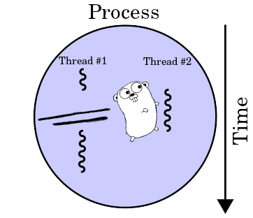
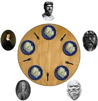

(c) **Cleuton Sampaio** 2018

## Programação concorrente com Goroutines



**Antes de começar:** Eu considero [**multiprogramação**](https://www.zemoleza.com.br/trabalho-academico/exatas/informatica/multiprogramacao/) [**multithreading**](https://pt.wikipedia.org/wiki/Thread_(computa%C3%A7%C3%A3o)) uma prática ruim no projeto e construção de aplicações. Acredito que, na medida do possível, o desenvolvedor deve deixar esta questão a cargo da infraestrutura que servirá sua aplicação, e não dentro do código-fonte, misturada com código funcional. Tal prática, além de acrescentar [**complexidade acidental**](http://www.obomprogramador.com/2012/12/complexidade-acidental.html) ao código, também aumenta o custo e a complexidade dos testes e do controle de qualidade, aumentando os riscos do projeto de software. Se possível, utilize altenativas como [**FaaS**](http://faas.guru) e deixe a [**escalabilidade**](https://pt.wikipedia.org/wiki/Escalabilidade) por conta da infraestrutura. 

[**Multiprogramação vs multiprocessamento**] é uma questão mal compreendida entre os programadores e frequentemente utilizada inapropriadamente. Vejamos os dois conceitos e suas diferenças: 

- **Multiprogramação**: É a capacidade de executar mais de um código **concorrentemente**, por exemplo, dividindo a CPU em fatias de tempo e permitindo que cada código execute um pouquinho, ou então quando um código faz uma operação de I/O, o controle é passado para outro;
- **Multiprocessamento**: É a capacidade de executar mais de um código **simultaneamente**! Em um sistema com múltiplas CPUs, podemos executar vários trechos de código (threads) ao mesmo tempo.

Ambas as técnicas possuem vantagens, desvantagens e riscos. A maior vantagem seria aproveitar melhor os recursos computacionais, através do aumento de eficiência que a execução concorrente ou simultânea traz. Porém, tornam seu código mais complexo, pelo menos na maioria das linguagens de programação. E trazem um risco enorme de **deadlocks** e **starvation**. O cientista E.W. **Dijkstra** demonstrou isso brilhantemente com o [**problema dos filósofos glutões**](https://pt.stackoverflow.com/questions/283375/o-que-%C3%A9-o-problema-dos-fil%C3%B3sofos-glut%C3%B5es).



- **Deadlock** ocorre quando um código em execução necessita de um recurso que o outro está utilizando e vice-versa.

## Goroutines

Vamos começar pela nossa conhecida [**sequência de Fibonacci**](https://pt.wikipedia.org/wiki/Sequ%C3%AAncia_de_Fibonacci). O [**código exemplo**](../../code/goroutines1/fibo.go) mostra como calcular de maneira iterativa: 

```
func FibonacciLoop(n int) int {
    f := make([]int, n+1, n+2)
    if n < 2 {
        f = f[0:2]
    }
    f[0] = 0
    f[1] = 1
    for i := 2; i <= n; i++ {
        f[i] = f[i-1] + f[i-2]
    }
    return f[n]
}
```

Esta primeira versão invoca a função de maneira iterativa e bloqueante, ou seja, a chamada à função bloqueia o thread principal (no caso do Go a **main Goroutine**): 

```
func main() {
	reader := bufio.NewReader(os.Stdin)
	for {
		fmt.Print("Type a term number or other character to finish: ")
		nints, _ := reader.ReadString('\n')
		nint, errInt := strconv.ParseInt(strings.TrimSpace(nints), 10, 64)
		if errInt != nil {
			break
		}
		fmt.Printf("You typed: %d and the term is %d\n", nint,FibonacciLoop(int(nint)))
	}
	
}
```

Este código poderia ser um componente RESTful invocando uma função lambda, certo? Esta chamada seria síncrona e bloqueadora, ou seja, o código teria que esperar o término da chamada a **FibonacciLoop()** antes de continuar. 

Com o conceito de **Goroutines** podemos implementar **multiprogramação** em nosso código, de maneira simples e prática. Vejamos isso no [**exemplo seguinte**](../../code/goroutines1/fibo2/fibo2.go):

```
func FibonacciLoop(n int) {
    f := make([]int, n+1, n+2)
    if n < 2 {
        f = f[0:2]
    }
    f[0] = 0
    f[1] = 1
    for i := 2; i <= n; i++ {
        f[i] = f[i-1] + f[i-2]
	}
	fmt.Printf("The term %d is %d\n",n,f[n])
}
...
func main() {
	reader := bufio.NewReader(os.Stdin)
	for {
		fmt.Print("Type a term number or other character to finish: ")
		nints, _ := reader.ReadString('\n')
		nint, errInt := strconv.ParseInt(strings.TrimSpace(nints), 10, 64)
		if errInt != nil {
			break
		}
		go FibonacciLoop(int(nint))
	}
}
```

Como pode ver, agora a nossa função **FibonacciLoop()** calcula e mostra o resultado. Uma **Goroutine** é iniciada com o comando **go** antes de sua invocação: 

```
go FibonacciLoop(int(nint))
```

Isto cria uma forma de **thread leve** que permite executar o código em paralelo. A chamada à **Goroutine** retorna imediatamente (por isso não podemos ter valores de retorno) e o código continua sua execução. Veja só que interessante: 

```
Type a term number or other character to finish: 5
Type a term number or other character to finish: The term 5 is 5
```

O código **main()** foi em frente e pediu mais um valor, e o resultado do cálculo anterior veio depois! 

## Comunicação através de channels

Essa implementação da nossa **Goroutine** está feia. Ela está fazendo **I/O** dentro da função! Eu preferia que ela retornasse um valor... Ok, vejamos então o conceito de **channel**, que é uma maneira de criarmos um canal entre **Goroutines**. Usando **channels** uma **Goroutine** pode escrever e a outra lerá. 

Declaramos um **channel** especificando seu tipo de dados, e o inicializamos com o comando **make**: 

```
var aChannel chan string
var otherChannel chan int
...
aChannel = make(chan string)
...
another := make(chan int)
```

Podemos declarar e inicializar no mesmo comando!

Para enviar ou ler dados de um canal, usamos o operador seta "<-":

```
aChannel <- fmt.Sprintf("The term %d is %d\n",n,f[n])
...
answer := <- aChannel
```

No primeiro exemplo, enviamos um string formatado para o canal, e no segundo, lemos do canal para uma variável.

A leitura e gravação em canais são operaçôes síncronas! Quando uma Goroutine grava em um canal, seu processamento é bloqueado até que outra Goroutine leia do canal. Respectivamente, quando uma Goroutine lê dados de um canal, seu processamento é igualmente bloqueado até que haja algo no canal.

Vejamos o [**terceiro exemplo**](../../code/goroutines1/fibo3/fibo3.go): 

```
func FibonacciLoop(n int, aChannel chan string) {
    f := make([]int, n+1, n+2)
    if n < 2 {
        f = f[0:2]
    }
    f[0] = 0
    f[1] = 1
    for i := 2; i <= n; i++ {
        f[i] = f[i-1] + f[i-2]
	}
	aChannel <- fmt.Sprintf("The term %d is %d\n",n,f[n])
}
...
func main() {
	reader := bufio.NewReader(os.Stdin)
	chAnswer := make(chan string)
	for {
		fmt.Print("Type a term number or other character to finish: ")
		nints, _ := reader.ReadString('\n')
		nint, errInt := strconv.ParseInt(strings.TrimSpace(nints), 10, 64)
		if errInt != nil {
			break
		}
		go FibonacciLoop(int(nint),chAnswer)
		answer := <- chAnswer
		fmt.Println(answer)
	}
}
```

Agora, virou uma chamada síncrona, pois o código de leitura do canal (```answer := <- chAnswer```) será bloqueado até que a função **FibonacciLoop()** grave algo nele. Há várias soluções para criar canais não bloqueantes. Podemos usar um **select** com uma opção **default**, que será invocada sem bloquear o código. Veja isso no [**exemplo final**](../../code/goroutines1/fibo4/fibo4.go): 

```
func main() {
	reader := bufio.NewReader(os.Stdin)
	chAnswer := make(chan string)
	for {
		fmt.Print("Type a term number or other character to finish: ")
		nints, _ := reader.ReadString('\n')
		nint, errInt := strconv.ParseInt(strings.TrimSpace(nints), 10, 64)
		if errInt != nil {
			break
		}
		go FibonacciLoop(int(nint),chAnswer)
		select {
		case answer := <-chAnswer:
			fmt.Println("Got an answer: ",answer)
		default:
			fmt.Println("waiting...")
		}
	}
}
```

A execução demonstra esse comportamento: 

```
Type a term number or other character to finish: 6
waiting...
Type a term number or other character to finish: 8
Got an answer:  The term 6 is 8
```

Ele não bloqueou a execução. 


