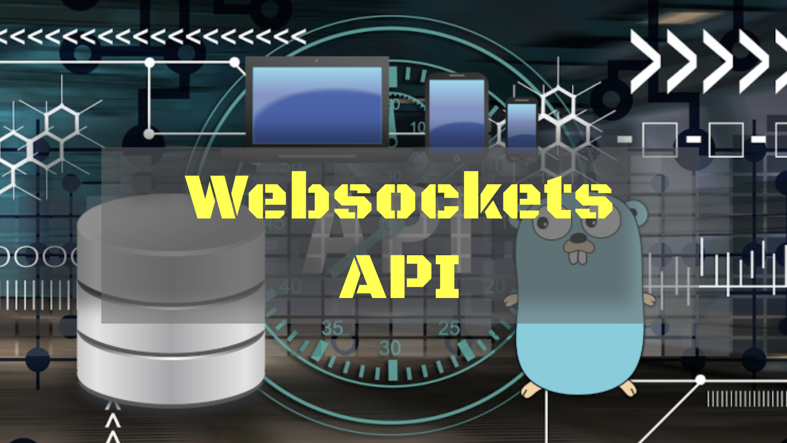

# Criando uma API com websockets

**Cleuton Sampaio**



## Entendendo Websockets

Websocket é um padrão e uma tecnologia para comunicação bidirecional em HTML, com Baixa latência. Está implementado no HTML 5 e vários navegadores dão suporte. 

Geralmente, a comunicação entre navegador e servidor é unidirecional, ou seja, quem iniciou a conexão envia mensagens e recebe respostas. Não há meio para que o servidor inicie comunicação com o navegador.

Websockets contornam essa dificuldade permitindo comunicação permanente e bidirecional entre o navegador e o servidor.

Funciona inicialmente com HTTP e o servidor faz "upgrade" da conexão. E a partir deste momento, navegador e servidor trocam mensagens via nova conexão. Por exemplo, podemos requisitar um Websocket utilizando o novo protocolo "ws", a partir do Navegador:

```
var connection = 

     new WebSocket('ws://server.example.com', 
                   ['soap', 'xmpp']);
```

Neste momento, o Navegador envia um request ao Servidor solicitando o "upgrade" para Websockets:

```
GET /chat HTTP/1.1
Host: server.example.com
Upgrade: websocket
Connection: Upgrade
Sec-WebSocket-Key: ...
Sec-WebSocket-Protocol: chat, superchat
Sec-WebSocket-Version: 13
Origin: http://example.com
```

E o Servidor, caso suporte o "upgrade", responde dessa forma:
```
HTTP/1.1 101 Switching Protocols
Upgrade: websocket
Connection: Upgrade
Sec-WebSocket-Accept: ...
Sec-WebSocket-Protocol: chat
```

A partir daí, o Cliente é acionado sempre que alguma mensagem chegar via o Websocket, como se fosse um Servidor, sem necessidade de ficar "cutucando" o Servidor para saber se tem nova mensagem. O Servidor simplesmente usa o Websocket e envia a mensagem ao Cliente.

## Websockets em Go

O pacote mais popular é o Gorilla/websockets: 
```
go get github.com/gorilla/websocket
``` 

Este pacote está em manutenção, embora seja o mais popular. Comece instalando ele. 

Uma API **websockets** é um servidor HTTP que disponibiliza um método para iniciar conexão websocket com o cliente. A partir daí, a comunicação passa a ser bidirecional e de baixa latência. Para isto, o servidor precisa fazer o **Upgrade** da conexão: 

```
func StartController(w http.ResponseWriter, r *http.Request) {
	ws.CheckOrigin = func(r *http.Request) bool { return true }
	wsocket, err := ws.Upgrade(w, r, nil)
	if err != nil {
		fmt.Println("upgrade failed: ", err)
		return
	}

	defer wsocket.Close()

	commandsLoop(wsocket)
}
```

A partir do **Upgrade** o **responder** passa a **conversar** com o cliente utilizando a conexão websockets. Você pode até abrir outra **goroutine** para isso, mas lembre-se que os responders são invocados em suas próprias **goroutines**.

```
for {
	msgType, message, err := wsocket.ReadMessage()
	if err != nil {
		fmt.Println("Error or connection closed:", err)
		break
	}
	command := string(message)
	response := sendToDrone(command)

	returnMessage := []byte(response)
	err = wsocket.WriteMessage(msgType, returnMessage)
	if err != nil {
		fmt.Println("Error or connection closed:", err)
		break
	}
}
```

O exemplo de código deste artigo demonstra um cliente HTML/Javascript conversando com um servidor Golang para controlar um drone (fictício). [**Veja o código**](../..//code/gowebsockets).